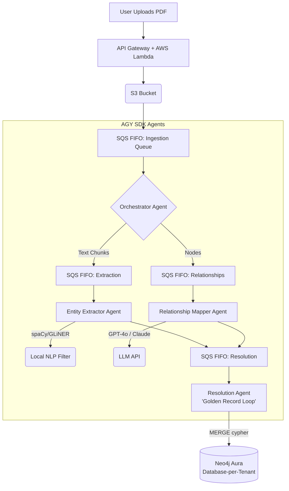

# Managed GraphRAG SaaS: System Design & Architecture Document
*Status: APPROVED | Phase: Pre-Implementation*

This is the living source of truth for the project. As we build, if we hit roadblocks, rate limits, or pipeline failures, we will update this document to reflect our pivots.

---

## 1. Core Architecture Diagram

The system relies on an asynchronous, queue-based multi-agent pipeline using the Antigravity (AGY) SDK, deployed entirely on AWS.

---

## 2. Component Specifications

### 2.1 The Ingestion Layer (`orchestrator.py`)
- **Role:** Chunks documents based on semantic boundaries.
- **Queue:** Pushes chunks to SQS FIFO to prevent concurrent overwrite and guarantee ordering using `MessageGroupId = document_id`.

### 2.2 The NLP Layer (`entity_extractor.py`)
- **Role:** Extracts base entities (Person, Org) *without* hitting the LLM.
- **Stack:** GLiNER + spaCy.
- **AWS Mitigation:** Deployed on AWS Lambda with **Provisioned Concurrency** (or Fargate with EFS `mmap`) to completely bypass the 15+ second cold start of loading a 2GB model into memory.

### 2.3 The LLM Layer (`relationship_mapper.py`)
- **Role:** Discovers complex relationships (edges) between the extracted nodes.
- **Prompting:** Uses strict JSON Schema to prevent hallucinated relationships.
- **AWS Mitigation:** If the LLM provider returns an `HTTP 429 Rate Limit`, the agent catches the error and dynamically modifies the SQS `VisibilityTimeout` for exponential backoff, preventing Dead Letter Queue (DLQ) flooding.

### 2.4 The Resolution Layer (`resolution_agent.py`)
- **Role:** Fixes the fragmented graph (e.g., merging "Microsoft" and "MSFT" into one node).
- **Concurrency Strategy:** Uses a **Single-Writer Queue** to avoid database deadlocks. The Resolution Agent is the *only* component allowed to execute Cypher `MERGE` statements against Neo4j.

### 2.5 The Storage Layer (Graph Database)
- **Database:** Neo4j (or Memgraph).
- **Security:** We employ **Physical Isolation (Database-per-Tenant)** to prevent cross-tenant data leakage or prompt injection attacks jumping graph boundaries.

---

## 3. Development Workflow (ECC Harness)

We are utilizing the `affaan-m/ecc` agent harness to build this cleanly.
1. **TDD First:** We will use the ECC `tdd-workflow` skill to write pytest suites for `orchestrator.py` before we write the LLM integrations.
2. **Review:** We will run `/code-review` after every major agent script is completed to check for queueing bugs or memory leaks.

---

## 4. Known Risks & Roadblocks (To monitor during build)
1. **Context Window Limits:** If our semantic chunking is too large, the LLM extraction will silently drop entities. *Mitigation: Track token sizes in `orchestrator.py`.*
2. **Neo4j Write Bottlenecks:** If the Single-Writer Resolution Agent is too slow, the SQS queue will backlog. *Mitigation: Batch Cypher transactions using `UNWIND`.*
