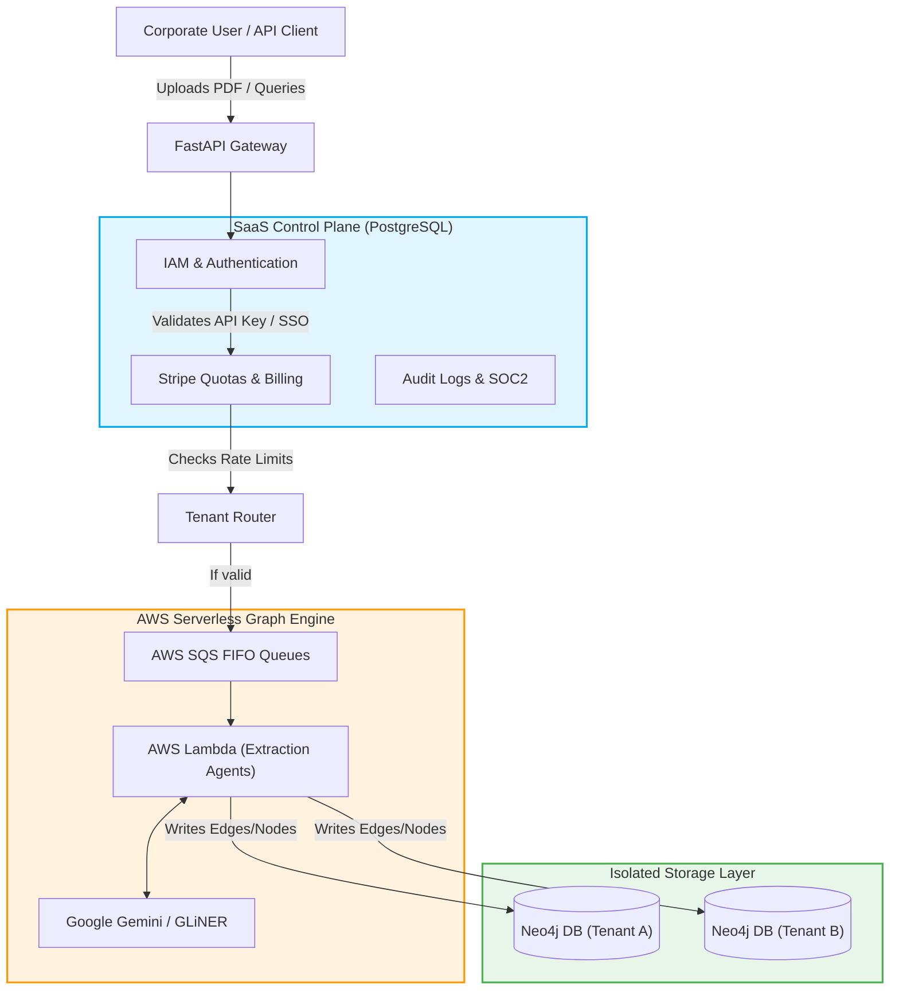
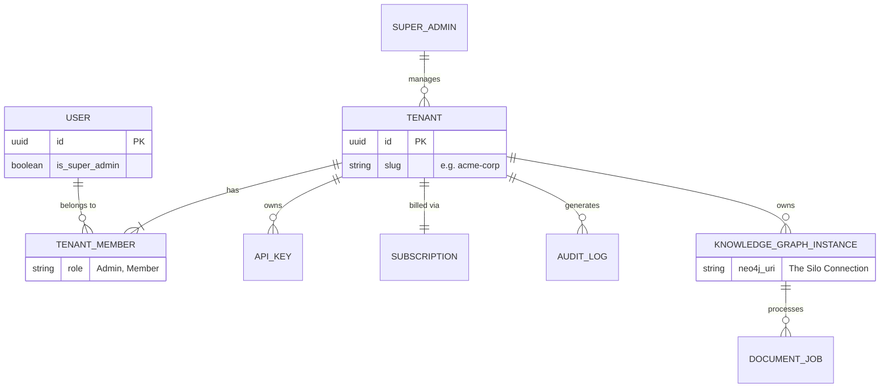
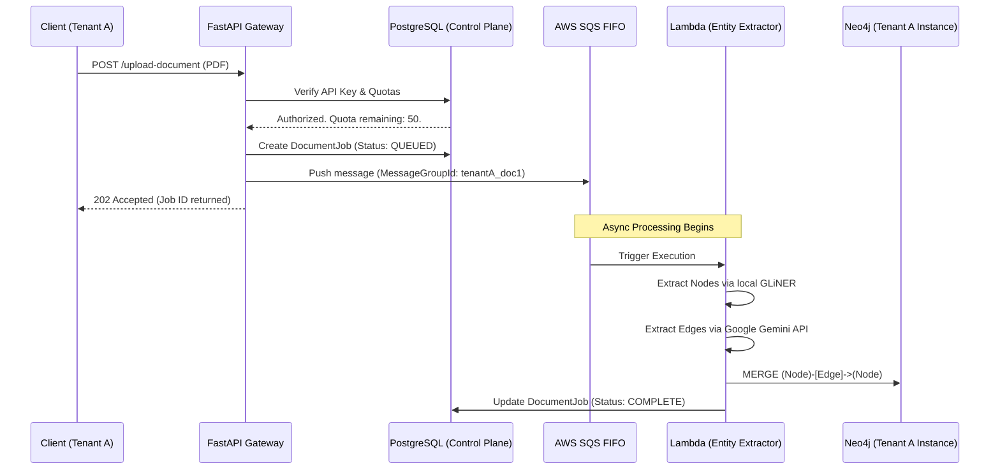

# SemanticGraph Cloud - System Architecture

## Goal Description
To provide a clear, visual understanding of the complete end-to-end system we are building. This document visualizes how the Enterprise SaaS Control Plane (PostgreSQL) routes traffic securely to the highly scalable AI Graph Engine (AWS Lambda + SQS + Neo4j).

## 1. High-Level Multi-Tenant Architecture

This diagram shows how a user request flows through the system. The **SaaS Control Plane** acts as the gatekeeper. Only if a user is authenticated and has quota remaining are they allowed to trigger the heavy AI graph extraction.

## 2. The Core SaaS Relational Schema (Entity-Relationship)

This diagram visualizes the exact SQLAlchemy database we are currently building. Notice how **every** resource strictly points back to the `Tenant` to guarantee data isolation.

## 3. The Asynchronous Extraction Pipeline

When a document is uploaded, it does not process instantly (which would time out the API). Instead, we use our AWS CDK infrastructure to process the document safely.

## User Review Required
Take a look at the three diagrams above. 
1. **The High-Level Architecture** shows how the system scales.
2. **The ER Diagram** shows how the data is isolated.
3. **The Sequence Diagram** shows the asynchronous event flow.

Does this visual breakdown clarify the massive enterprise system we are constructing?
